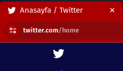

# Wingbeat

> Improve Twitter experience

## Features

* Return Back the Old Twitter Icon

    
* Remove Spam Tweets
* Custom Color Theme Support

    

# License

* Licensed with Apache 2.0 License
* The Twitter logo, House Heart icon and Hash icon was taken from Bootstrap Icons. Bootstrap Icons is licensed by MIT License.
* The Twitter logo is registered trademark of Twitter.

## FAQ

### Will the extension remove sponsored content?

> No. The extension is not an adblocker. And The extension will not remove any ad even if they are in the spam category.

# Disclaimer

> Using the extension can cause visual dissonance, remove un-spam tweets and broke your Twitter experince.

> Using the extension can cause many sanctions up to the closure of your account. Use the extension in your responsibility.
